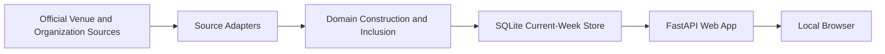
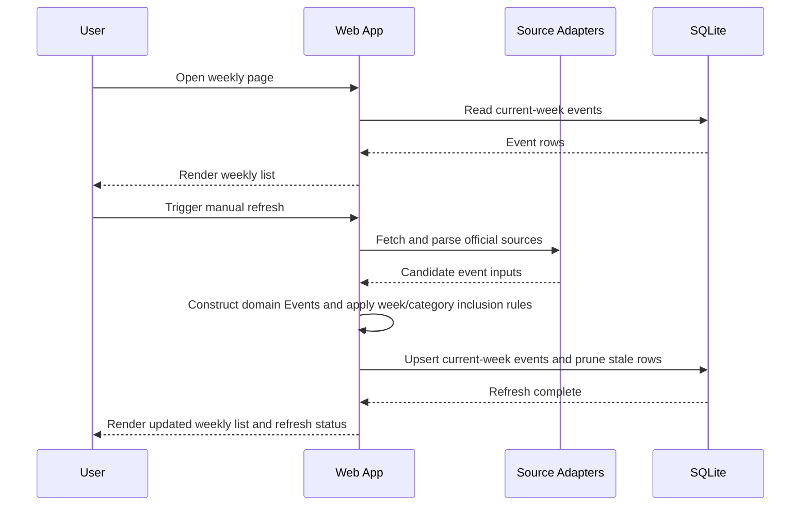

# Architecture

## Document Purpose

This document separates product and business scope from technical implementation so scope decisions do not get mixed with framework decisions.

## Business Domain Scope

### Product Goal

Build a local web app that assembles a weekly list of greater Boston events from official venue and organization sources.

### Scope Summary

| Area | V0 Decision | Notes |
| --- | --- | --- |
| Primary user value | One reliable weekly view of upcoming events | Emphasis is aggregation, not ticketing or editorial content |
| Geography | Greater Boston area | Not limited to Boston proper |
| Output | Single weekly events list | Later phases may add filtering and richer views |
| Storage window | Current week only | Older and out-of-window events are pruned |
| Refresh model | Manual refresh in V0 | Scheduler added after V0 |
| Authoritative week window | Monday `00:00` to next Monday `00:00` in `America/New_York` | Shared rule across T2, T4, and T5 |
| Geo representation in V0 | Source-driven coverage plus domain location keys | No geo filtering beyond chosen sources in V0 |

### Event Category Scope

| Category | V0 | Notes |
| --- | --- | --- |
| `concert` | Yes | Includes live music and similar performances |
| `theater` | Yes | Includes theater and performing arts |
| `exhibition` | No | Domain should support later addition |
| `museum_special` | No | Includes museum night or special-program events |
| `film` | No | Includes screenings and cinema programming |

### Source Policy

| Decision | Direction |
| --- | --- |
| Source priority | Official venue or organization pages first |
| Parsing priority | Structured event metadata first |
| Fallback policy | Add source-specific parsing only when needed |
| Initial coverage | Narrow, reliable set of 4-6 greater Boston sources |

### Out of Scope for V0

| Item | Reason |
| --- | --- |
| Broad citywide discovery across every event source | Too much source variability for first release |
| Historical archive | Current-week product only |
| User accounts or personalization | No user-specific workflows in V0 |
| Ticket purchases or affiliate flows | Aggregation only |
| Exhibition, museum special-night, and film ingestion | Deferred to later source packs |

## Technical Design

### Stack Decisions

| Concern | Decision | Why |
| --- | --- | --- |
| Backend | Python + FastAPI | Good fit for ingestion-heavy backend with room to grow |
| Rendering | Server-rendered HTML templates | Minimal UI complexity for V0 |
| Database | SQLite | Low operational cost for a local current-week app |
| Scheduling | Deferred in V0 | Manual refresh first, background refresh later |

### System Boundaries

| Boundary | Responsibility |
| --- | --- |
| `domain` | Canonical `Event` shape, field normalization rules, identity rules, category definitions, and inclusion rules |
| `sources` | Fetch raw source data, parse source-specific payloads, and emit adapter-owned candidate inputs for domain construction |
| `storage` | Persistence, within-source upsert support by `event_key`, and current-week pruning; cross-source deduplication is out of scope |
| `web` | HTML routes, refresh actions, orchestration, and view models |

### Context Diagram

### Runtime Flow

### Canonical Domain Reference

The canonical domain shape is defined in [t2-domain-model.md](./t2-domain-model.md).

This architecture document does not redefine the domain model; it depends on the T2 identity and inclusion rules.

### Storage Record Direction

| Field | Purpose |
| --- | --- |
| `event_key` | Stable domain identity for one current record |
| `title` | Stored display title |
| `category` | Stored category used by the weekly UI |
| `venue_key` | Stable venue identifier |
| `venue_name` | Stored venue display name |
| `location_key` | Stable location identifier |
| `city` | Stored location display field |
| `region` | Stored location display field |
| `country_code` | Stored location display field |
| `organizer_key` | Optional organizer identifier |
| `organizer_name` | Optional organizer display field |
| `starts_at` | Timezone-aware start datetime |
| `source_url` | Absolute provenance/display URL only |
| `source_name` | Stable internal source identifier |
| `identity_kind` | Which identity branch produced `event_key` |
| `identity_inputs` | Structured identity material used to derive `event_key` |
| `last_seen_at` | Refresh timestamp used for pruning and stale-record handling |

### Storage Direction

| Decision | Approach |
| --- | --- |
| Persistence scope | Store only current-week events |
| Cleanup policy | Prune rows outside the current week during refresh |
| Isolation | Keep storage logic behind a repository layer |
| Repository boundary | Web and source orchestration must depend on repository interfaces, not inline SQL |
| Query/build style | Prefer a persistence layer that keeps SQLite an implementation detail rather than a business-logic dependency; SQLAlchemy 2.x is the current recommendation |
| Migrations | Prefer explicit schema migrations rather than ad hoc table creation in application code; Alembic is the current recommendation |
| Migration posture | Avoid SQLite-specific coupling so Postgres remains a cheap later move |

### Source Ingestion Rules

1. Start from official source pages only.
2. Attempt generic structured-data extraction first, including JSON-LD and similar machine-readable payloads.
3. Let adapters extract source-native identifiers and source-specific metadata, but emit candidate inputs rather than making storage-shape decisions.
4. Construct canonical domain `Event` objects and apply weekly/category inclusion after adapter parsing, using the shared T2 rules.
5. Introduce source-specific parsing only for sources where generic extraction is insufficient.
6. Keep source adapters isolated so future category packs can be added incrementally.
