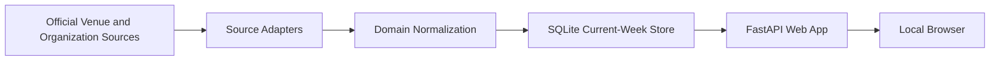
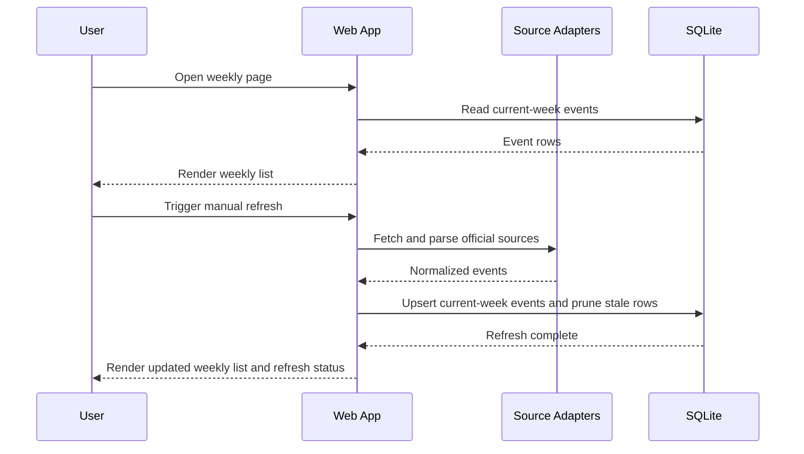

# Architecture

## Document Purpose

This document separates product and business scope from technical implementation so scope decisions do not get mixed with framework decisions.

## Business Domain Scope

### Product Goal

Build a local web app that assembles a weekly list of greater Boston events from official venue and organization sources.

### Scope Summary

| Area | V0 Decision | Notes |
| --- | --- | --- |
| Primary user value | One reliable weekly view of upcoming events | Emphasis is aggregation, not ticketing or editorial content |
| Geography | Greater Boston area | Not limited to Boston proper |
| Output | Single weekly events list | Later phases may add filtering and richer views |
| Storage window | Current week only | Older and out-of-window events are pruned |
| Refresh model | Manual refresh in V0 | Scheduler added after V0 |

### Event Category Scope

| Category | V0 | Notes |
| --- | --- | --- |
| `concert` | Yes | Includes live music and similar performances |
| `theater` | Yes | Includes theater and performing arts |
| `exhibition` | No | Domain should support later addition |
| `museum_special` | No | Includes museum night or special-program events |
| `film` | No | Includes screenings and cinema programming |

### Source Policy

| Decision | Direction |
| --- | --- |
| Source priority | Official venue or organization pages first |
| Parsing priority | Structured event metadata first |
| Fallback policy | Add source-specific parsing only when needed |
| Initial coverage | Narrow, reliable set of 4-6 greater Boston sources |

### Out of Scope for V0

| Item | Reason |
| --- | --- |
| Broad citywide discovery across every event source | Too much source variability for first release |
| Historical archive | Current-week product only |
| User accounts or personalization | No user-specific workflows in V0 |
| Ticket purchases or affiliate flows | Aggregation only |
| Exhibition, museum special-night, and film ingestion | Deferred to later source packs |

## Technical Design

### Stack Decisions

| Concern | Decision | Why |
| --- | --- | --- |
| Backend | Python + FastAPI | Good fit for ingestion-heavy backend with room to grow |
| Rendering | Server-rendered HTML templates | Minimal UI complexity for V0 |
| Database | SQLite | Low operational cost for a local current-week app |
| Scheduling | Deferred in V0 | Manual refresh first, background refresh later |

### System Boundaries

| Boundary | Responsibility |
| --- | --- |
| `domain` | Event model, category definitions, inclusion rules |
| `sources` | Fetching and parsing official source pages |
| `storage` | Persistence, deduplication support, current-week pruning |
| `web` | HTML routes, refresh actions, view models |

### Context Diagram

### Runtime Flow

### Data Model Direction

| Field | Purpose |
| --- | --- |
| `title` | Display name of the event |
| `category` | Domain classification such as `concert` or `theater` |
| `venue` | Venue or host name |
| `city` | Greater Boston locality |
| `starts_at` | Start date and time |
| `source_url` | Direct event or listing URL |
| `source_name` | Name of the originating source |
| `last_seen_at` | Timestamp used during refresh and pruning |

The model should support deferred categories without redesigning the schema.

### Storage Direction

| Decision | Approach |
| --- | --- |
| Persistence scope | Store only current-week events |
| Cleanup policy | Prune rows outside the current week during refresh |
| Isolation | Keep storage logic behind a repository layer |
| Migration posture | Avoid SQLite-specific coupling so Postgres remains a cheap later move |

### Source Ingestion Rules

1. Start from official source pages only.
2. Attempt generic structured-data extraction first, including JSON-LD and similar machine-readable payloads.
3. Introduce source-specific parsing only for sources where generic extraction is insufficient.
4. Keep source adapters isolated so future category packs can be added incrementally.
