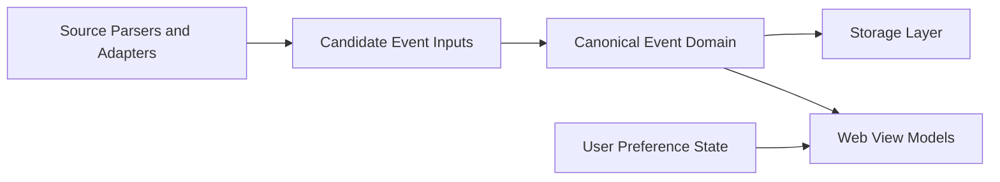
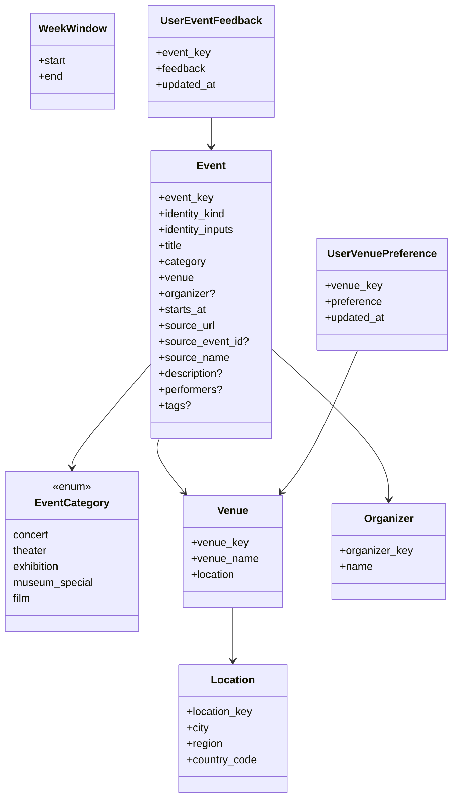

# T2: Core Event Model and Inclusion Rules

## Purpose

This document captures the design and execution plan for Task 2.

Task 2 defines the normalized event domain model and the inclusion rules that later tasks will rely on for parsing, storage, and presentation.

## Objective

Establish a minimal but stable domain contract for weekly events in the greater Boston area.

The output of this task should be sufficient for:

- source adapters to emit candidate event inputs for canonical domain construction
- storage code to persist current-week events consistently
- web routes to render a unified weekly list
- future personalization features to attach user preferences without redesigning the core event model

## Business-Domain Decisions

### Scope Decisions

| Area | Decision | Notes |
| --- | --- | --- |
| Weekly window | Calendar week in `America/New_York` | Monday `00:00` to next Monday `00:00` |
| V0 included categories | `concert`, `theater` | Agreed V0 scope |
| Deferred but modeled now | `exhibition`, `museum_special`, `film` | Supported by the domain taxonomy but not by V0 ingestion |
| Geography handling | Keep display labels and stable location identifiers separate | Avoid future ambiguity such as same-name cities in different regions |
| Venue handling | Keep display labels and stable venue identifiers separate | Needed for user venue preferences and future recommendation work |
| Organizer handling | Model organizer separately from venue and source | One organizer may produce events across multiple venues |
| Time requirement | `starts_at` must be timezone-aware | Avoids ambiguity in week filtering and storage |
| Date-only events | Excluded from V0 | Revisit for later categories such as exhibitions |
| Personalization model | Keep user preference state separate from canonical event data | Avoid mixing source data with user-specific state |

### Inclusion Rule Decisions

| Rule | Decision |
| --- | --- |
| Category inclusion | Only V0 categories are in scope for V0 filtering |
| Week inclusion | Event must satisfy `week_start <= starts_at_local < week_end` |
| Inclusion timestamp field | Inclusion is based only on `starts_at` |
| Timezone basis | Weekly inclusion is evaluated after converting `starts_at` to `America/New_York` |
| Events earlier than now | Events earlier than the current time but still inside the current week remain members of the weekly list |
| Partial events | Events lacking a concrete timezone-aware start datetime are out of scope for V0 unless an adapter can unambiguously localize the time |

## Technical Design

### Domain Model Overview

T2 defines domain objects, not database tables.

Storage mapping and table design are deferred to T4. The goal in T2 is to define a clean object model that later tasks can use consistently.

### Object Inventory

| Object | Implemented in T2 | Purpose |
| --- | --- | --- |
| `EventCategory` | Yes | Domain taxonomy for event categories |
| `Location` | Yes | Stable geographic identity plus display location fields |
| `Venue` | Yes | Stable venue identity plus display venue fields |
| `Organizer` | Yes | Event presenter or producing organization |
| `Event` | Yes | Normalized event record used across parser, storage, and web layers |
| `WeekWindow` or equivalent helper | Yes | Encapsulates start/end bounds for the current week |
| `UserEventFeedback` | No | Future adjacent model for user-specific feedback on an event |
| `UserVenuePreference` | No | Future adjacent model for user-specific preference for a venue |

### Event Model Fields

| Field | Required | Purpose |
| --- | --- | --- |
| `event_key` | Yes | Stable event identifier for storage and user feedback attachment |
| `identity_kind` | Yes | Closed-set identity branch used to derive `event_key` |
| `identity_inputs` | Yes | Structured inputs used to derive `event_key` |
| `title` | Yes | Human-readable event title |
| `category` | Yes | Domain category |
| `venue` | Yes | Venue value object |
| `organizer` | No | Organizer value object when the source provides it |
| `starts_at` | Yes | Timezone-aware event start |
| `source_url` | Yes | Absolute provenance/display URL only |
| `source_event_id` | No | Optional source-native event identifier when exposed by the source |
| `source_name` | Yes | Stable internal source identifier used for provenance and source-scoped keys |
| `description` | No | Optional richer event text for future filtering and recommendation |
| `performers` | No | Optional performer or participant names |
| `tags` | No | Optional normalized tags for future recommendation and filtering |

`last_seen_at` is intentionally deferred from the T2 domain object because it belongs more naturally to refresh and persistence concerns introduced later.

Adapters must provide `source_url` as an absolute URL.

### Performance Granularity Rule

T2 defines `Event` at the level of one scheduled performance or showing.

Implications:

- one performance/showtime equals one `Event`
- recurring series produce multiple `Event` instances when they have multiple concrete start times
- multi-showtime source pages may map to many `Event` instances sharing the same `source_url`

This rule keeps weekly inclusion, key derivation, and future user feedback aligned around concrete performances rather than abstract series containers.

This rule is appropriate for V0 categories such as concerts and theater. Deferred categories such as exhibitions and museum programs may require a later availability model for multi-day spans and daily opening hours rather than a single `starts_at`.

### Location Model Fields

| Field | Required | Purpose |
| --- | --- | --- |
| `location_key` | Yes | Stable location identifier |
| `city` | Yes | Human-readable locality name |
| `region` | Yes | Region or state abbreviation |
| `country_code` | Yes | Country code such as `US` |

### Venue Model Fields

| Field | Required | Purpose |
| --- | --- | --- |
| `venue_key` | Yes | Stable venue identifier |
| `venue_name` | Yes | Human-readable venue name |
| `location` | Yes | Location value object for the venue |

### Organizer Model Fields

| Field | Required | Purpose |
| --- | --- | --- |
| `organizer_key` | Yes | Stable organizer identifier |
| `name` | Yes | Human-readable organizer name |

### Key Derivation Rules

Stable keys in T2 are deterministic application keys, not claims of perfect global identity across all sources.

Cross-source deduplication is a later concern and must not be inferred from `event_key` alone.

#### Normalization Rules

| Input Type | Rule |
| --- | --- |
| Domain text used in keys | Apply Unicode NFKC normalization, trim, collapse internal whitespace, casefold |
| Source-native identifiers used in keys | Treat as opaque values; do not apply NFKC, casefold, or whitespace normalization. Store raw values in `identity_inputs`, then encode deterministically as UTF-8 and percent-encode bytes outside RFC 3986 unreserved characters when constructing key material. Percent escapes use uppercase hex digits |
| Free-form text in final key components | Encode normalized text as UTF-8 and percent-encode to URL-safe ASCII, leaving only RFC 3986 unreserved characters unescaped. Percent escapes use uppercase hex digits |
| Country and region | Lowercase in key material, preserve uppercase only for display fields if needed later |
| UTC timestamps used in keys | Convert to UTC and serialize as ISO 8601 with whole-second precision in the form `YYYY-MM-DDTHH:MM:SSZ` |
| Fallback title normalization | Domain-defined, not adapter-defined; adapters provide raw titles and the domain applies the text rules above with `normalization_version = v1` |

#### Key Scope and Derivation

Derived keys are opaque identifiers. The human-readable segments shown below are part of the wire format, but only the top-level `{type}:v1:` prefix is a supported structural contract. Consumers must not parse nested semantics such as `{source_name}`, `{branch}`, or embedded component boundaries by splitting the remainder on `:`.

Code must branch on `identity_kind` and `identity_inputs`, not by parsing `event_key`, even though `event_key` contains human-readable segments.

| Key | Scope | V1 Derivation Rule |
| --- | --- | --- |
| `location_key` | App-global | `loc:v1:{country_code}:{region}:{city}` from normalized display location fields |
| `venue_key` | App-global | `venue:v1:{location_key_encoded}:{venue_name}` from normalized venue name plus the encoded `location_key` component |
| `organizer_key` | App-global | `org:v1:{name}` from normalized organizer display name |
| `event_key` | Source-scoped | `event:v1:{source_name}:{branch}:{identifier}` where `branch` is one of `occ`, `src`, or `hash` |

`venue_key` and `organizer_key` are intended to be app-global identifiers so that user preferences can attach to one venue or organizer concept across sources when names remain stable.

In V1, these keys are still name-derived and may change if venues or organizers materially rename themselves. Alias handling and merge/reconciliation are later concerns and are out of scope for T2.

In V1, `organizer_key` may also collide for distinct organizers that share the same normalized name. This is an accepted V1 risk. Later work may introduce organizer aliases or additional disambiguators if collisions become material.

`source_name` must be a stable internal source slug/identifier, not a display label, and it must match `^[a-z0-9_-]+$`. Renaming an adapter's `source_name` is a breaking key change for that source.

#### Identity Kinds

`identity_kind` is a closed set:

- `occurrence_id`
- `source_event_id_starts_at`
- `fallback_hash`

`identity_kind` maps to the `event_key` branch token as follows:

- `occurrence_id` -> `occ`
- `source_event_id_starts_at` -> `src`
- `fallback_hash` -> `hash`

#### Identity Inputs

`identity_inputs` is a structured object containing exactly the logical values used to derive `event_key`. Source-native IDs are stored as raw values in `identity_inputs`; percent-encoding is a deterministic derivation step used only when constructing the final key string.

When `identity_inputs` contains `starts_at_utc`, it must use the exact normalized UTC string that participates in key material: `YYYY-MM-DDTHH:MM:SSZ` with whole-second precision.

Examples:

- `occurrence_id`:
  - `{"source_name": "...", "occurrence_id": "..."}`
- `source_event_id_starts_at`:
  - `{"source_name": "...", "source_event_id": "...", "starts_at_utc": "..."}`
- `fallback_hash`:
  - `{"source_name": "...", "normalized_title": "...", "starts_at_utc": "...", "venue_key": "...", "normalization_version": "v1"}`

For `fallback_hash`, `normalization_version` participates in derivation because it identifies the exact normalization contract used to produce `normalized_title`.

#### `event_key` Identifier Precedence

##### Branch 1: `occurrence_id`

Use `occurrence_id` only when `(source_name, occurrence_id)` identifies exactly one concrete performance.

Format: `event:v1:{source_name}:occ:{occurrence_id_encoded}`

In branch `occurrence_id`, `event_key` remains stable even if `starts_at_utc` is later corrected or rescheduled.

Adapters must not set `occurrence_id` unless the source guarantees that `(source_name, occurrence_id)` continues to identify exactly one concrete performance over time, not merely because it appears unique in current URLs or markup.

##### Branch 2: `source_event_id_starts_at`

If the source-native identifier is a series/container identifier, or the adapter is not sure it is stable per performance, treat it as `source_event_id` instead.

Use `source_event_id_starts_at` when the adapter has a stable series/container identifier and a concrete `starts_at_utc`.

Format: `event:v1:{source_name}:src:{source_event_id_encoded}:{starts_at_utc_encoded}`

If a source's `source_event_id` can span multiple venues, cities, or performances, the adapter must either emit a true `occurrence_id` or scope `source_event_id` so `(source_name, source_event_id, starts_at_utc)` is unique.

##### Branch 3: `fallback_hash`

Use `fallback_hash` only when `starts_at_utc` is known and a concrete venue identity exists so `venue_key` can be derived. The `fallback_hash` branch is not available without a concrete venue identity.

Format: `event:v1:{source_name}:hash:{sha256_hex}`

Derivation for `fallback_hash` is:

1. Build a structured payload containing exactly:
   - `source_name`
   - `normalized_title`
   - `starts_at_utc`
   - `venue_key`
   - `normalization_version`
2. Serialize that payload as UTF-8 JSON using:
   - object keys sorted lexicographically
   - minified JSON with no whitespace after commas or colons
   - `ensure_ascii = false`
   - standard JSON escaping only; `/` is not escaped
3. Hash the resulting bytes with SHA-256.
4. Encode the digest as lowercase hexadecimal.

Branch `fallback_hash` is best-effort only. Title changes, venue changes, or normalization-rule changes can churn identity.

In branches `source_event_id_starts_at` and `fallback_hash`, a corrected or rescheduled `starts_at_utc` intentionally produces a new `event_key`.

`source_url` is provenance/display only. If an adapter can extract a stable identifier from a URL, it should pass that value as `occurrence_id` or `source_event_id` rather than relying on domain URL-based identity.

Branches `source_event_id_starts_at` and `fallback_hash` require `starts_at_utc`. If scheduled time is unknown, do not emit a T2 `Event`. T2 represents scheduled performances only; TBA/unscheduled items belong in a different pre-T2 bucket/model.

### Timezone Handling Rules

| Rule | Decision |
| --- | --- |
| Domain requirement | `Event.starts_at` must always be timezone-aware |
| Accepted input timezone | Any timezone-aware datetime is acceptable in the domain model |
| Week inclusion timezone | Convert to `America/New_York` before evaluating current-week membership |
| Naive local times | Adapters may attach `America/New_York` only when the source context makes local Boston-area time unambiguous |
| Ambiguous naive times | Exclude from V0 rather than guessing |

### Personalization-Oriented Domain Fields

The canonical event model should remain source-derived, but T2 should reserve space for user-state models that can attach to stable IDs later.

| Object | Candidate Fields | Purpose |
| --- | --- | --- |
| `UserEventFeedback` | `event_key`, `feedback`, `updated_at` | Capture event-level interest and disinterest |
| `UserVenuePreference` | `venue_key`, `preference`, `updated_at` | Capture venue-level preferences |

These user-state models are documented in T2 for forward compatibility but are not implemented in T2.

Recommended feedback values for future work:

- `interested`
- `not_interested`
- `attended`

Recommended venue preference values for future work:

- `preferred`
- `neutral`
- `hidden`

### Boundary Diagram

### Domain Object Diagram

`UserEventFeedback` and `UserVenuePreference` are shown for future shape only and are not implemented in T2.

### Domain Rules

1. The domain model should be strict enough to prevent ambiguous event records.
2. The domain model should remain small and should not include storage-specific metadata yet.
3. Inclusion logic should be separated from parsing and storage concerns.
4. T2 should not perform heuristic category inference from raw source data; adapters must provide the category explicitly when mapping source data into the domain model.
5. Canonical event data and user preference data should remain separate domain concepts.
6. Display labels and stable identifiers should both exist where future ambiguity is likely, especially for events, venues, and locations.
7. `event_key` is a stable source-scoped identifier, not a cross-source deduplication key.
8. `event_key` must resolve to one concrete performance, not to a series container or a source page that aggregates many performances.
9. `source_url` is provenance only and must not be used by the domain as an identity branch.

## Implementation Plan

| Step | Plan |
| --- | --- |
| 1 | Add failing tests for the event model shape and validation rules |
| 2 | Add failing tests for the event category taxonomy |
| 3 | Add failing tests for local calendar-week boundary calculation |
| 4 | Add failing tests for V0 inclusion filtering by week and category |
| 5 | Implement the minimal domain package needed to satisfy those tests |
| 6 | Run Task 2 tests plus the existing bootstrap test |
| 7 | Self-review for over-modeling and remove anything not needed by later tasks |
| 8 | Keep implementation split into commits no larger than 500 LOC |

## Test Plan

| Test Area | Purpose |
| --- | --- |
| Event model tests | Verify required fields, stable identifiers, and timezone-aware datetime expectations |
| Location model tests | Verify stable location identity plus display fields |
| Venue model tests | Verify venue identity and linkage to location |
| Organizer model tests | Verify organizer identity and naming expectations |
| Category tests | Verify the defined taxonomy and V0 category set |
| Week-window tests | Verify Monday-to-Monday current-week boundaries in `America/New_York`, including exactly Monday `00:00`, exactly next Monday `00:00`, and timezone conversion across a local-day boundary |
| Inclusion-rule tests | Verify in-scope vs out-of-scope behavior for week and category decisions |
| Key-derivation tests | Verify deterministic key generation, identity kinds, identity inputs, precedence rules, fixed canonical-serialization/SHA-256 vectors, and percent-encoding of non-ASCII titles and opaque source-native IDs |
| Performance granularity tests | Verify that multi-showtime and recurring source data map to one `Event` per concrete start time |
| Preference model tests | Verify the minimal user-feedback and venue-preference domain contracts if implemented in T2 |

## Out of Scope

| Item | Reason |
| --- | --- |
| Source adapter interfaces | Covered in T3 |
| Parsing raw HTML or JSON-LD | Covered in T3 |
| Database schema and repository behavior | Covered in T4 |
| UI rendering concerns | Covered in T5 |
| Cross-source deduplication and reconciliation logic | More appropriate once storage exists; within-source upsert by `event_key` is a storage concern, not a T2 domain concern |
| Category inference from heterogeneous sources | More appropriate once source parsing exists |
| Recommender scoring or ranking logic | Belongs in a later task after user feedback exists |
| Full implementation of `UserEventFeedback` and `UserVenuePreference` | Deferred to a later task |
| Availability models for multi-day/open-hours categories such as exhibitions | Requires a later extension beyond single-`starts_at` events |

## Exit Criteria

Task 2 is complete when:

- the normalized event model is implemented and tested
- the event category taxonomy is implemented and tested
- current-week boundary calculation is implemented and tested
- V0 inclusion rules are implemented and tested
- stable identifiers for events, venues, and locations are defined and tested
- stable key derivation rules are documented and tested
- `event_key` derivation is explicitly performance-scoped and safe for multiple showtimes on one source page
- URL-based identity has been removed from the domain contract
- organizer is modeled separately from venue and source
- future personalization models are documented but not implemented
- the resulting domain contract is small, explicit, and suitable for T3, T4, and T5
