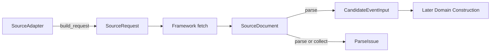
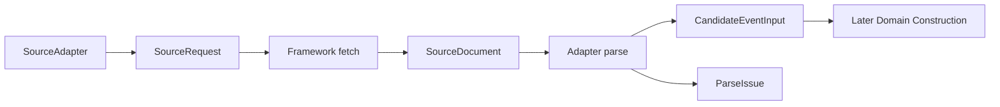
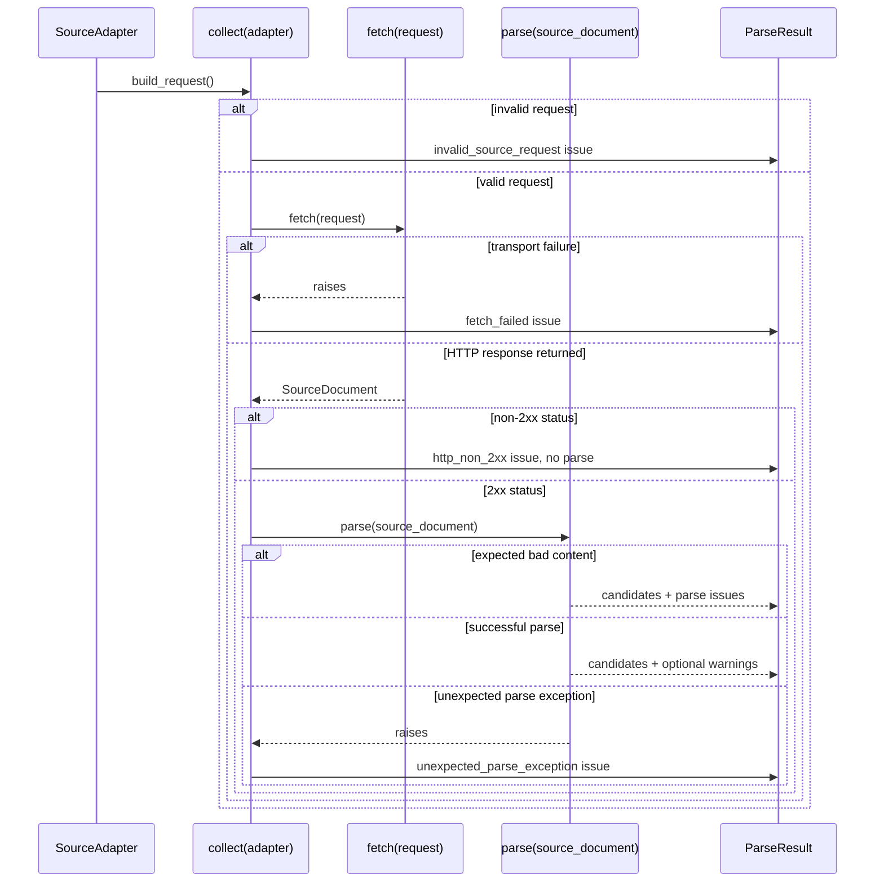

# T3: Source Adapter Framework and Generic Parser

## TL;DR

T3 defines the source-layer contract before any real venue adapters exist.

It will:

- describe one source request
- fetch one source document through shared framework code
- parse generic JSON-LD only
- emit `CandidateEventInput` records plus `ParseIssue`s
- stop before canonical T2 `Event` construction, storage, or venue-specific parsing

The main non-trivial decisions are:

- keep adapters as pure parsers plus request descriptors
- move fetch semantics into shared framework code
- keep candidates separate from canonical domain events
- allow partial candidates, but define what is promotable to T2 later
- allow adapter-owned timezone disambiguation through explicit adapter configuration or source-specific parse logic
- keep source-native identity extraction out of the generic parser

## Purpose

This document captures the design and execution plan for Task 3.

Task 3 defines the source-layer contract that sits in front of the T2 domain model. It establishes how adapters describe source requests, parse structured event data from fetched documents, emit candidate event inputs, and report issues without yet implementing real venue-specific adapters.

## Objective

Establish a minimal but stable source-adapter framework that can:

- build a source request
- fetch a source document through shared framework code
- parse machine-readable event data from that document
- emit candidate event inputs for later canonical domain construction
- report parse and fetch issues in a structured way

The output of this task should be sufficient for:

- T6 to implement real venue adapters against a stable interface
- T7 refresh orchestration to collect candidates and issues consistently
- later persistence/orchestration layers to consume source outputs without guessing source behavior

## Business-Domain Decisions

### Scope Decisions

| Area | Decision | Notes |
| --- | --- | --- |
| Parsing target | Generic JSON-LD extraction only | No source-specific venue parsers in T3 |
| Adapter output | Candidate event inputs, not canonical `Event` objects | Keeps the source/domain boundary explicit |
| Schedule strictness | `starts_at` may be absent, but if present it must be timezone-aware | Unschedulable raw timestamps should produce issues, not invalid candidates |
| Category handling | `category` is optional in T3 | Generic extractors may expose schema types without inventing domain categories |
| Fetching | Basic fetch support is included, but owned by framework code | Tests remain fixture-based |
| Real venues | Out of scope | Deferred to T6 |

### Boundary Decisions

| Decision | Direction |
| --- | --- |
| Adapter responsibility | Build one request and parse one fetched document |
| Framework responsibility | Execute fetches, lock HTTP behavior, and orchestrate `collect()` |
| Candidate completeness | Candidates may be incomplete, but must not violate T2 invariants when later promoted |
| T2 alignment | T3 must not emit data that forces heuristic category or time guessing later |

### Key Tradeoffs

| Decision | Chosen Direction | Pros | Cons |
| --- | --- | --- | --- |
| Adapter output | `CandidateEventInput`, not `Event` | Keeps source/domain boundary clean; avoids premature identity/storage coupling | Requires later promotion step |
| Fetch ownership | Framework-owned fetch, adapter-owned parse | One canonical place for redirects/non-2xx/header semantics; simpler fixture tests | Slightly more framework structure in T3 |
| Generic parser target | JSON-LD only | High signal, fixture-friendly, low fragility for T3 | Misses sources without structured data |
| Timezone disambiguation | Adapter-owned explicit configuration or source-specific parse logic | Explicit and testable; avoids hidden guessing | Some sources will still emit issues instead of promotable candidates |
| Event-like detection | Allowlist of schema event types | Better real-world coverage than exact `Event` only | Still incomplete vs source-specific parsing |

## Technical Design

### Architecture Overview

T3 separates source transport from source parsing.

- adapters describe what to fetch and how to parse it
- shared framework code performs the fetch with one locked HTTP behavior
- parsers emit `CandidateEventInput`
- later orchestration/domain logic decides whether a candidate can be promoted into a canonical T2 `Event`

This keeps transport rules, parser rules, and canonical domain construction separate.

### High-Level Flow

### Responsibility Split

| Layer | Responsibility | Not Responsible For |
| --- | --- | --- |
| `SourceAdapter` | Source name, timezone configuration, request description, source-specific parsing | HTTP transport behavior, retries, redirect policy, canonical T2 object construction |
| Framework fetch/collect | Request execution, HTTP status handling, redirect handling, fetch exception wrapping | Venue-specific parsing logic, category heuristics |
| Generic JSON-LD extractor | Structured-data extraction from one fetched document | Arbitrary HTML scraping, browser execution, source-specific fallbacks |
| Later domain/storage layers | Promotion to T2 `Event`, identity derivation, persistence | Source transport and raw JSON-LD parsing |

### Object Inventory

| Object | Implemented in T3 | Purpose |
| --- | --- | --- |
| `SourceAdapter` | Yes | Contract for describing one source request and parsing one fetched document |
| `SourceRequest` | Yes | Framework input describing what to fetch |
| `SourceDocument` | Yes | Captures one fetch result and its fetched content |
| `CandidateEventInput` | Yes | Structured candidate record emitted by adapters/parsers |
| `ParseIssue` | Yes | Structured issue produced during fetch or parse |
| `ParseResult` | Yes | Collection of candidates and issues from one parse |
| `JsonLdExtractor` or equivalent helper | Yes | Generic extraction of event-like JSON-LD nodes |

### Source Adapter Contract

Recommended interface:

| Member | Purpose |
| --- | --- |
| `source_name` | Stable source identifier matching T2 slug rules |
| `default_tz` | Adapter-owned `ZoneInfo | None` used by the generic extractor to localize naive timestamps when a single timezone applies |
| `build_request()` | Return one `SourceRequest` describing the fetch input |
| `parse(source_document)` | Parse a successful fetched document into `ParseResult`; expected bad content should produce issues rather than normal parse exceptions |

Framework contract:

- `collect(adapter)` calls `build_request()` before any fetch work
- if `build_request()` raises, `collect(adapter)` returns a `ParseResult` with no candidates plus one fetch-phase `ParseIssue` using `code = invalid_source_request`
- if `build_request()` returns an invalid `SourceRequest`, `collect(adapter)` returns a `ParseResult` with no candidates plus one fetch-phase `ParseIssue` using `code = invalid_source_request`
- framework validation for `SourceRequest` includes:
  - `requested_url` must be an absolute `http` or `https` URL
  - `source_name` must equal `adapter.source_name`
  - `headers`, when present, must be `Mapping[str, str]`
- `fetch(request)` is framework-owned and not adapter-specific
- `fetch(request)` returns `SourceDocument` for any completed HTTP response, including non-2xx responses
- `fetch(request)` raises only on transport or retrieval failure where no usable HTTP response is available
- `fetch(request)` follows redirects up to a fixed limit of 10
- `fetch(request)` does not retry in T3
- `fetch(request)` uses one shared framework timeout policy rather than per-adapter timeout behavior
- for framework-owned HTTP fetches, `status_code` must be populated on every completed response so non-2xx handling is deterministic
- redirect-limit failures and similar client-side redirect exceptions are treated as transport failures and surfaced as `fetch_failed`
- `fetch(request)` must preserve `request.source_name` onto the returned `SourceDocument`
- `fetch(request)` must preserve `requested_url` as absolute `http` or `https`, and `fetched_url` must also be absolute `http` or `https`
- `collect(adapter)` is framework-owned
- on transport failure, `collect(adapter)` returns a `ParseResult` with no candidates plus one fetch-phase `ParseIssue` using `code = fetch_failed`
- on completed HTTP response with non-2xx `status_code`, `collect(adapter)` returns a `ParseResult` with no candidates plus one fetch-phase `ParseIssue` using `code = http_non_2xx` and does not call `parse()`
- on successful fetch, `collect(adapter)` calls `parse(source_document)`
- `parse(source_document)` should not raise for expected bad content such as malformed JSON-LD, missing fields, or unschedulable timestamps
- those expected bad-content cases should be reported as parse-phase `ParseIssue`s
- `collect(adapter)` still catches unexpected parse exceptions and converts them into one parse-phase `ParseIssue` using `code = unexpected_parse_exception`
- when `collect(adapter)` catches an unexpected parse exception, it should discard any partial candidates/issues and return only the single `unexpected_parse_exception` issue
- parsers must emit `CandidateEventInput.source_name = source_document.source_name`

This discard-on-unexpected-exception rule is intentional. It gives `ParseResult` one clear invariant:

- either it is a normal parse result with candidates/issues from normal control flow
- or it is a single fatal parse failure result with `unexpected_parse_exception`

### `SourceRequest`

| Field | Required | Purpose |
| --- | --- | --- |
| `source_name` | Yes | Stable adapter/source identifier |
| `requested_url` | Yes | Absolute `http` or `https` URL to fetch |
| `headers` | No | `Mapping[str, str] | None`; optional request headers when a source requires them |

### `SourceDocument`

| Field | Required | Purpose |
| --- | --- | --- |
| `source_name` | Yes | Stable adapter/source identifier |
| `requested_url` | Yes | Absolute `http` or `https` URL originally requested by the adapter |
| `fetched_url` | Yes | Absolute `http` or `https` final URL after redirects, used as the parsing base URL |
| `content` | Yes | Raw fetched document text |
| `content_type` | No | Reported content type when known |
| `status_code` | Yes | `int`; HTTP status for the completed framework-owned fetch |
| `headers` | No | `Mapping[str, str] | None`; best-effort single-value response headers when useful for debugging content/redirect behavior |
| `fetched_at` | Yes | Timezone-aware UTC timestamp of fetch completion |

### `CandidateEventInput`

`CandidateEventInput` is the source-layer output object for one possible event record.

| Field | Required | Purpose |
| --- | --- | --- |
| `title` | No | Candidate display title when extractable |
| `category` | No | `EventCategory | None`; domain category only when explicitly known without heuristics |
| `schema_types` | Yes | Observed schema.org or source type labels as `tuple[str, ...]`; may be empty |
| `starts_at` | No | Parsed timezone-aware datetime; must be tz-aware when present |
| `source_url` | Yes | Absolute candidate provenance/event URL; use the resolved node URL when available, otherwise fall back to `fetched_url` |
| `source_name` | Yes | Stable source identifier |
| `occurrence_id` | No | Source-native per-performance identifier when available |
| `source_event_id` | No | Source-native series/container identifier when available |
| `venue_name` | No | Candidate venue label |
| `city` | No | Candidate city/locality |
| `region` | No | Candidate region/state |
| `country_code` | No | Candidate country code |
| `organizer_name` | No | Candidate organizer label |
| `description` | No | Candidate description text |
| `performers` | Yes | Candidate performers/participants as `tuple[str, ...]`, default empty |
| `tags` | Yes | Candidate tags as `tuple[str, ...]`, default empty |

Rules:

- `starts_at` is `datetime | None`
- when present, `starts_at` must be timezone-aware
- `category` is optional because generic structured-data extraction must not invent domain categories
- the generic JSON-LD extractor must not map `schema_types` into `EventCategory`; generic candidates should normally leave `category = None`
- `schema_types` captures observed structured-data types without implying T2 category mapping
- `schema_types` is a tuple of trimmed type labels in source order, with duplicates removed by exact string equality after type normalization; it may be empty when no usable type metadata exists
- an empty `schema_types` means no usable `@type` metadata was present or parseable for that node
- example normalization:
  - input `["@type": ["schema:MusicEvent", "https://schema.org/Event"]]` becomes `("MusicEvent", "Event")`
- `source_url` is always required on emitted candidates and must be absolute
- emitted `source_url` values must be absolute `http` or `https` URLs
- the generic extractor should choose `source_url` by this precedence:
  - first try `url`
  - if `url` is missing or unusable, then try `@id`
  - if neither yields a usable URL, fall back to `fetched_url`
- relative `url` and relative `@id` values should be resolved against `fetched_url`
- a node-specific URL field is usable only when it resolves to an absolute `http` or `https` URL
- relative `@id` values are URL candidates when they are ordinary relative URI references without a scheme and not blank-node or fragment-only identifiers
- blank-node identifiers such as `_:b0`, fragment-only identifiers, and other non-path-like `@id` values are not URL candidates and should be ignored for `source_url` selection
- ignored non-URL `@id` values are treated as absent for `url_resolution_failed` emission
- emit `url_resolution_failed` only when at least one node-specific URL candidate is present but none of the available node-specific URL candidates yield a usable absolute `http` or `https` URL
- when one node-specific URL field is unusable but a later field in precedence order yields a usable URL, do not emit `url_resolution_failed`
- if a JSON-LD node lacks a usable node-specific URL, the parser should use `fetched_url` as the candidate provenance fallback
- generic extraction must not populate `occurrence_id` or `source_event_id` from URL-like fields such as `url` or `@id`; that is an adapter-owned decision
- optional text fields are either `None` or non-blank after trimming
- collection fields such as `schema_types`, `performers`, and `tags` should contain only non-blank trimmed strings

### Generic JSON-LD Field Mapping

The generic extractor should use these deterministic field mappings:

| Candidate Field | JSON-LD Source | Mapping Rule |
| --- | --- | --- |
| `title` | `name` | Accept non-blank string only |
| `description` | `description` | Accept non-blank string only |
| `starts_at` | `startDate` | Parse per T3 datetime rules |
| `venue_name` | `location.name` or string `location` | Accept non-blank string; if `location` is a string, use it as `venue_name` |
| `city` | `location.address.addressLocality` | Accept non-blank string only |
| `region` | `location.address.addressRegion` | Accept only when the trimmed value normalizes to 2-3 ASCII letters; emit uppercase form |
| `country_code` | `location.address.addressCountry` | Accept only when the trimmed value normalizes to exactly 2 ASCII letters; emit uppercase form |
| `organizer_name` | `organizer.name` or string `organizer` | Accept non-blank string |
| `performers` | `performer` or `performers` | Accept string items or object `.name` values; preserve source order, trim, drop blanks, dedupe by exact string equality after trimming |
| `tags` | `keywords` | If string, split on commas; if array, accept string items only; trim, drop blanks, dedupe by exact string equality after trimming |
| `schema_types` | `@type` | Normalize per the `@type` normalization rules |

Field-shape rules:

- for object-or-array fields, the generic extractor should accept either a single object/string or a list of objects/strings
- for single-valued candidate fields, when the source shape is a list, choose the first usable value in source order and ignore later values
- single-valued fields using this rule include:
  - `title`
  - `description`
  - `starts_at`
  - `venue_name`
  - `city`
  - `region`
  - `country_code`
  - `organizer_name`
  - `source_url` candidate inputs from `url` and `@id`
- unsupported shapes should be ignored rather than guessed
- if a field is present but unusable due to shape/type mismatch and that field affects schedulability or provenance, the extractor must emit the corresponding parse issue
- if a field is present but unusable due to shape/type mismatch and does not affect schedulability or provenance, ignore it without emitting an issue

Known limitation:

- the strict `region` and `country_code` acceptance rules intentionally leave many generic JSON-LD candidates non-promotable
- this is expected in T3 and should be improved later by source-specific mapping in T6 rather than heuristics in the generic extractor
- non-recursive node enumeration intentionally misses nested event patterns such as `WebPage.mainEntity -> Event` and container objects that hold `event` arrays
- this is expected in T3 and should be improved later by source-specific mapping in T6 rather than by broad recursive guessing in the generic extractor

### `ParseIssue`

| Field | Required | Purpose |
| --- | --- | --- |
| `code` | Yes | Stable machine-readable issue identifier |
| `phase` | Yes | `fetch` or `parse` |
| `severity` | Yes | `warning` or `error` |
| `message` | Yes | Human-readable issue detail |
| `source_ref` | No | Concrete reference such as JSON-LD script index and node identifier |

Recommended `source_ref` format for JSON-LD:

- JSON-LD parse issues should always include `source_ref`
- `script[i]` indexing is based on JSON-LD `<script type=\"application/ld+json\">` blocks only, in document order
- use:
  - `script[0]`
  - `script[1] @id=https://example.com/event/123`
  - `script[0] name=Hamilton`
- when both `@id` and `name` are available, prefer `@id`

Standard `code` values used by T3:

- `invalid_source_request`
- `fetch_failed`
- `http_non_2xx`
- `unexpected_parse_exception`
- `invalid_jsonld`
- `unsupported_jsonld_shape`
- `non_event_node_skipped`
- `missing_start_date`
- `naive_start_date_no_tz`
- `date_only_start_date`
- `invalid_start_date`
- `ambiguous_local_start_date`
- `nonexistent_local_start_date`
- `url_resolution_failed`

Severity semantics:

- `warning` means extraction was partial or degraded, but candidate emission may still be valid
- `error` means the affected field or node could not be trusted as-is
- candidates may still be emitted alongside `error` issues when the error is scoped to one field/node and does not invalidate other emitted candidates
- `non_event_node_skipped` should normally be suppressed in production-style runs and is mainly useful for debug/test visibility

Default severities used by T3:

| Code | Default Severity |
| --- | --- |
| `invalid_source_request` | `error` |
| `fetch_failed` | `error` |
| `http_non_2xx` | `error` |
| `unexpected_parse_exception` | `error` |
| `invalid_jsonld` | `error` |
| `unsupported_jsonld_shape` | `error` |
| `missing_start_date` | `warning` |
| `naive_start_date_no_tz` | `warning` |
| `date_only_start_date` | `warning` |
| `invalid_start_date` | `warning` |
| `ambiguous_local_start_date` | `warning` |
| `nonexistent_local_start_date` | `warning` |
| `url_resolution_failed` | `warning` |
| `non_event_node_skipped` | `warning` |

Default phases used by T3:

| Code | Phase |
| --- | --- |
| `invalid_source_request` | `fetch` |
| `fetch_failed` | `fetch` |
| `http_non_2xx` | `fetch` |
| `unexpected_parse_exception` | `parse` |
| `invalid_jsonld` | `parse` |
| `unsupported_jsonld_shape` | `parse` |
| `non_event_node_skipped` | `parse` |
| `missing_start_date` | `parse` |
| `naive_start_date_no_tz` | `parse` |
| `date_only_start_date` | `parse` |
| `invalid_start_date` | `parse` |
| `ambiguous_local_start_date` | `parse` |
| `nonexistent_local_start_date` | `parse` |
| `url_resolution_failed` | `parse` |

### `ParseResult`

| Field | Required | Purpose |
| --- | --- | --- |
| `candidates` | Yes | Parsed candidate event inputs |
| `issues` | Yes | Fetch/parse issues emitted during processing |

### JSON-LD Extraction Rules

The generic parser in T3 is specifically a JSON-LD extractor.

Supported input shapes:

- one JSON object
- one JSON array
- one object containing `@graph`

Supported behavior:

- find event-like nodes
- extract structured fields when present
- preserve observed schema types
- resolve relative URLs against `fetched_url`
- parse `startDate` into timezone-aware datetime when possible
- do not dereference in-graph `@id` references in T3
- enumerate JSON-LD nodes deterministically:
  - process JSON-LD script blocks in document order
  - for a top-level object without `@graph`, treat that object as one candidate node
  - for a top-level array, process elements in array order
  - for a top-level object with `@graph`, process `@graph` entries in array order
  - do not recursively walk nested objects as additional nodes
- emit `ParseResult.candidates` and `ParseResult.issues` in that traversal order

Not supported in T3:

- arbitrary HTML scraping beyond locating JSON-LD blocks
- browser execution
- source-specific fallbacks
- heuristic category inference
- in-graph `@id` dereferencing across nodes in the same `@graph`

JSON-LD script-level issue semantics:

- process JSON-LD one script block at a time
- if one script block cannot be parsed as JSON, emit one `invalid_jsonld` issue for that script block and continue to the next script block
- if one script block parses as JSON but its top-level value is neither:
  - an object
  - an array
  - or an object containing `@graph`
  then emit one `unsupported_jsonld_shape` issue for that script block and continue to the next script block
- script-level JSON-LD issues do not stop parsing of later script blocks

Event-like node detection for the generic extractor:

- normalize each node's `@type` into `schema_types`
- normalize `@type` values by:
  - accepting string or array forms
  - trimming whitespace
  - stripping `schema:` prefixes
  - collapsing full schema.org IRIs such as `https://schema.org/MusicEvent` to their terminal type name
- the generic extractor should treat a node as event-like when one normalized type is in the allowlist:
  - `Event`
  - `MusicEvent`
  - `PerformingArtsEvent`
  - `TheaterEvent`
- nodes outside that allowlist should be skipped by the generic extractor and may be handled later by source-specific logic if needed
- by default, skipped non-event nodes do not emit `non_event_node_skipped`
- `non_event_node_skipped` is reserved for explicit debug/test runs and is not part of the normal default `ParseResult`
- when implemented, that debug/test behavior should be enabled only by an explicit extractor option such as `JsonLdExtractorOptions(include_non_event_node_skipped=True)`, not by default

Candidate emission policy for event-like nodes:

- if a node is event-like but missing promotable fields, the generic extractor should still emit a `CandidateEventInput` only when the node provides at least one non-empty meaningful extracted field beyond type metadata
- meaningful extracted fields for this threshold are:
  - `title`
  - a `startDate` value only when it is a non-blank string
  - a node-specific `url` value only when it is a non-blank string
  - an `@id` value only when it is a URL candidate under the `source_url` rules
  - `venue_name`
  - `organizer_name`
  - `description`
  - non-empty `performers`
  - non-empty `tags`
- missing or unschedulable fields should produce `ParseIssue`s rather than forcing candidate suppression, but only for nodes that meet the candidate emission threshold
- a node should be skipped entirely when it is not event-like, or when it has no meaningful extracted fields beyond `@type`, or when the JSON-LD payload is too malformed to produce a meaningful candidate object
- `missing_start_date` should be emitted only for event-like nodes that meet the candidate emission threshold but have no `startDate` field
- wrong-typed `startDate`, `url`, and `@id` values do not count toward the candidate emission threshold
- when a node is skipped for failing the candidate emission threshold, node-level issues are suppressed

### Date/Time Rules

T3 must align with T2 schedulability constraints.

Rules:

- accepted `startDate` input for the generic extractor is string data only
- trim leading and trailing whitespace from `startDate` strings before validation
- the generic extractor accepts only these `startDate` string shapes:
  - `YYYY-MM-DD`
  - `YYYY-MM-DDTHH:MM`
  - `YYYY-MM-DDTHH:MM:SS`
  - `YYYY-MM-DDTHH:MM:SS.s` through `YYYY-MM-DDTHH:MM:SS.ssssss`
  - each date-time form above may additionally end with `Z` or a numeric offset of the form `+HH:MM` or `-HH:MM`
- forms with a space separator instead of `T` are not accepted
- a string in one of the accepted date-time forms with an explicit `Z` or numeric offset is valid and should emit a timezone-aware `starts_at`
- a string in accepted date-only form such as `YYYY-MM-DD` is date-only and should emit `date_only_start_date`
- a string in an accepted date-time form without an explicit offset or UTC designator is a naive local timestamp
- timezone abbreviations such as `EST` or `EDT` are not accepted by the generic extractor and should emit `invalid_start_date`
- non-string or otherwise unsupported `startDate` values should emit `invalid_start_date`
- if a timestamp can be deterministically parsed into a timezone-aware datetime under those rules, emit it as `starts_at`
- if a naive local timestamp is encountered, the generic extractor may localize it only by applying `adapter.default_tz`
- explicit adapter-owned logic may be:
  - a single adapter-level `default_tz: ZoneInfo`
  - source-specific parse logic that deterministically derives a timezone for that record
- `default_tz` should be a concrete `ZoneInfo` supplied by the adapter, not a free-form string
- adapters for sources that legitimately span multiple timezones should leave `default_tz = None` and use source-specific parse logic before emitting candidates
- deterministic localization means the chosen timezone for that record makes the naive local time neither ambiguous nor nonexistent
- date-only values remain unschedulable in T3 and should produce issues rather than guessed datetimes
- if the source only provides a date-only value, emit `date_only_start_date`
- if the generic extractor sees a naive local timestamp and no explicit adapter-owned timezone logic is available, emit `naive_start_date_no_tz`
- if the chosen timezone makes a naive local timestamp ambiguous, emit `ambiguous_local_start_date`
- if the chosen timezone makes a naive local timestamp nonexistent, emit `nonexistent_local_start_date`
- do not emit an invalid naive `starts_at`
- the only T3-approved source of timezone disambiguation is explicit adapter-owned logic; the generic extractor itself must not guess a timezone

Known limitation:

- the strict `startDate` grammar intentionally rejects many real-world variants that are not in the locked T3 forms above
- this is expected in T3 and should be improved later by source-specific mapping in T6 rather than by broad heuristic parsing in the generic extractor

### Promotable Candidate Requirements

A `CandidateEventInput` is promotable toward a canonical T2 `Event` only when later steps have enough information to satisfy T2.

At minimum, promotion requires:

- non-empty `title`
- non-`None` `category`
- timezone-aware `starts_at`
- absolute `source_url`
- non-empty `venue_name`
- non-empty `city`
- non-empty `region`
- non-empty `country_code`

Candidates that do not meet these requirements may still be emitted by T3, but they must not be promoted into T2 `Event` objects until the missing information is supplied by later adapter/domain mapping steps.

These venue and location fields are the minimum needed for later T2 derivation of `location_key` and `venue_key`.

This means the generic JSON-LD extractor will often emit non-promotable candidates until later source-specific mapping in T6 supplies explicit category and richer venue/location information. In particular, generic JSON-LD extraction should be expected to leave many candidates with `category = None`.

### Boundary Diagram

### Failure Flow

## Domain Rules

1. T3 must not collapse the boundary between source parsing and canonical domain construction.
2. Generic structured-data extraction must not invent T2 categories heuristically.
3. Candidate timestamps must be timezone-aware when present.
4. Invalid or unschedulable timestamps should produce issues rather than malformed candidates.
5. Relative URLs must be resolved against `fetched_url`, not guessed from unrelated context.
6. Fetch and parse concerns should be separable so fixture-based parser tests do not require network access.
7. Generic extraction must not derive source-native identity from URLs.

## Implementation Plan

| Step | Plan |
| --- | --- |
| 1 | Write failing tests for source contract objects and JSON-LD extraction fixtures |
| 2 | Implement source contract types (`SourceRequest`, `SourceDocument`, `CandidateEventInput`, `ParseIssue`, `ParseResult`) |
| 3 | Implement the `SourceAdapter` interface plus framework-owned `fetch()` and `collect()` helpers |
| 4 | Implement generic JSON-LD extraction and event-like node parsing |
| 5 | Run T3 tests plus the existing T2 suite |
| 6 | Self-review for overreach and keep source-specific parsing out of the task |

## Test Plan

| Test Area | Purpose |
| --- | --- |
| Source contract tests | Verify adapter, fetch result, candidate input, parse issue, and parse result shapes |
| Fetch failure contract tests | Verify non-2xx responses produce `http_non_2xx` and skip parse |
| JSON-LD shape tests | Verify extraction from object, array, and `@graph` forms |
| URL resolution tests | Verify relative URLs are resolved against `fetched_url` |
| Datetime parsing tests | Verify timezone-aware timestamps are emitted and unschedulable values produce issues |
| Category handling tests | Verify generic extraction may emit schema types without forcing T2 category inference |
| Emission-threshold tests | Verify incomplete event-like nodes are emitted or skipped according to the locked threshold rules |
| Issue reporting tests | Verify stable codes, phases, and concrete `source_ref` values |

## Out of Scope

| Item | Reason |
| --- | --- |
| Real venue or theater adapters | Covered in T6 |
| Storage integration | Covered in T4 |
| Web refresh orchestration | Covered in T7 |
| Browser automation or JavaScript execution | Too heavy for T3 |
| Heuristic category inference from source text | Conflicts with the locked T2 boundary |
| HTML scraping fallbacks for non-JSON-LD sources | Defer until T6 if needed |

## Exit Criteria

Task 3 is complete when:

- the source adapter contract is implemented and tested
- generic JSON-LD extraction is implemented and tested
- parser output is expressed as candidate inputs plus issues
- generic extraction does not invent T2 categories heuristically
- timestamp parsing behavior is explicit and aligned with T2 rules
- the resulting source-layer boundary is stable enough for T4, T6, and T7 to build on
