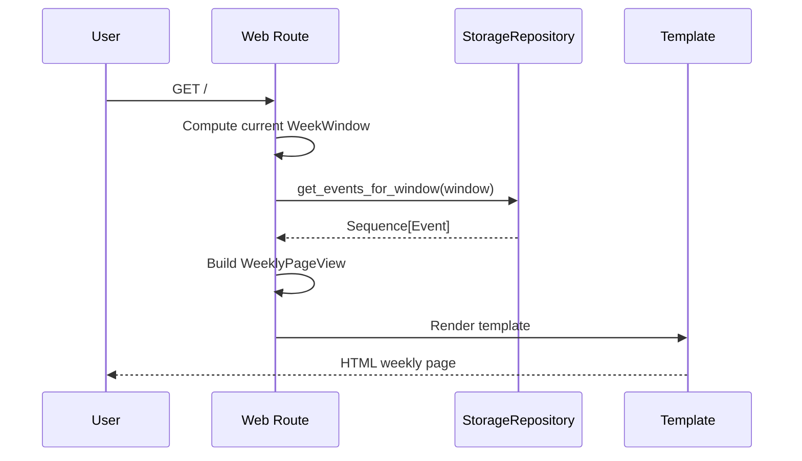

# T5: Web UI Shell and Weekly List Page

## TL;DR

T5 turns the current FastAPI bootstrap route into the first usable local web page.

It will:

- replace the JSON bootstrap response at `/` with a server-rendered weekly events page
- read the current week from the T4 repository
- render a simple weekly list for V0 `concert` and `theater` events
- show a refresh-status placeholder without implementing refresh yet
- stop before refresh actions, filters, or client-side interactivity

The main non-trivial decisions are:

- keep the primary route at `/`
- render server-side HTML from a web-specific view model instead of exposing domain objects directly to templates
- compute the displayed week from the shared T2 `week_window_for()` rule
- group the page by local day for readability, while keeping the initial page intentionally simple

## Purpose

This document captures the design and execution plan for Task 5.

Task 5 defines the first real web surface for the app. It sits on top of the
T2 domain rules, the T4 repository, and the FastAPI bootstrap created in T1.
The goal is to make the app locally usable before refresh orchestration exists.

## Objective

Establish a minimal but stable web layer that can:

- serve one weekly HTML page
- read current-week events from storage
- render those events in a readable weekly layout
- expose a refresh-status placeholder so T7 can later attach refresh behavior

The output of this task should be sufficient for:

- manual inspection of stored events in a browser
- T6 and T7 to plug ingestion and refresh behavior into an already-defined UI shell
- later UI work to extend the weekly page without redefining the route or template boundary

## Business-Domain Decisions

### Scope Decisions

| Area | Decision | Notes |
| --- | --- | --- |
| Primary page | One weekly list page at `/` | Keep the local app entry point simple |
| Supported categories | Show only what T2/T4 already store in V0 | No new category logic in T5 |
| Sort order | Local chronological order within the current week | Reuse T4 repository ordering expectations |
| Grouping | Group events by local calendar day | Easier to scan than one flat list |
| Empty state | Explicit empty-state UI | Must still feel like a usable page before T6/T7 |
| Refresh UI | Placeholder only | Real refresh action waits for T7 |
| Filters | Out of scope | No query-param or client-side filters in T5 |

### Boundary Decisions

| Decision | Direction |
| --- | --- |
| Route input | Browser requests only; no query params in V0 | Keeps T5 surface stable and small |
| Data source | Repository-driven | Web must not read SQLite directly |
| Time basis | Compute current week from an injectable `now` source | Keeps tests deterministic |
| Template input | Web-specific view model | Avoid templates reaching into domain/storage concerns |

### Key Tradeoffs

| Decision | Chosen Direction | Pros | Cons |
| --- | --- | --- | --- |
| Root route | Reuse `/` for the weekly page | Matches product goal and keeps entry point obvious | Removes the bootstrap JSON route |
| Rendering | Server-side templates | Simple, testable, fits V0 | Less dynamic than a JS UI |
| Layout | Day-grouped weekly list | Readable and familiar | Slightly more view-model work than one flat list |
| Refresh affordance | Placeholder text only | Keeps T5 focused; no fake actions | UI remains partially inert until T7 |
| View boundary | Dedicated page/view dataclasses | Cleaner templates and tests | Small extra translation layer |

## Technical Design

### Architecture Overview

T5 keeps the web layer thin:

- FastAPI handles the route
- web code computes the current `WeekWindow`
- the repository returns canonical T2 `Event` objects
- the web layer translates them into page-specific view data
- a server-rendered template produces HTML

This keeps T5 aligned with the architecture contract:

- domain owns identity and inclusion rules
- storage owns persistence and week-window queries
- web owns presentation only

### High-Level Flow

```mermaid
flowchart LR
    A[Browser GET /] --> B[FastAPI route]
    B --> C[week_window_for(now)]
    C --> D[StorageRepository.get_events_for_window]
    D --> E[Event domain objects]
    E --> F[WeeklyPageView builder]
    F --> G[HTML template]
    G --> H[Rendered weekly page]
```

### Request Flow



### Web Boundary

The T5 web layer should introduce a presentation boundary rather than passing
domain objects straight into the template.

Recommended objects:

| Object | Purpose |
| --- | --- |
| `WeeklyPageView` | Top-level template context for the page |
| `WeeklyDaySectionView` | One calendar-day grouping on the page |
| `WeeklyEventItemView` | One rendered event row/card |
| `RefreshStatusView` | Placeholder refresh/status panel content |

Why:

- templates stay presentation-focused
- tests can assert on stable page/view behavior without relying on template internals
- later T7 refresh state can plug into the same top-level page shape

### Route Contract

Recommended route behavior:

| Route | Method | Purpose |
| --- | --- | --- |
| `/` | `GET` | Render the weekly events page |

Rules:

- `/` becomes the primary product route
- the route should return HTML, not JSON
- the route should compute the displayed `WeekWindow` from a timezone-aware `now`
- the route must read from `StorageRepository.get_events_for_window(window)`
- the route should not mutate storage or trigger refresh in T5

### Application Wiring

`create_app()` should become configurable enough for deterministic web tests.

Recommended direction:

| Dependency | Direction |
| --- | --- |
| `repository` | Injectable, defaults to a local SQLite repository |
| `now_provider` | Injectable callable returning timezone-aware `datetime` |

This gives T5 stable tests without forcing the route to mock global time or
touch SQLite directly.

The default `now_provider` must return a timezone-aware `datetime`; otherwise
`week_window_for()` will reject it.

### View-Model Shape

Recommended top-level page shape:

| Field | Purpose |
| --- | --- |
| `week_label` | Human-readable label such as `Mar 23 – Mar 29, 2026`, where the displayed end date is `week_end_exclusive - 1 day` in local time |
| `week_start` | Local week start for machine-readable/template use |
| `week_end_exclusive` | Local exclusive week end |
| `day_sections` | Ordered rendered sections for each local day containing events |
| `total_events` | Summary count for the week |
| `refresh_status` | Placeholder panel content |
| `has_events` | Convenient empty-state flag |

Recommended event item fields:

| Field | Purpose |
| --- | --- |
| `event_key` | Stable item identifier for markup/testing hooks, exposed as a `data-event-key` attribute rather than an element id |
| `title` | Display title |
| `category_label` | Human-readable V0 category label |
| `starts_at_label` | Local time label such as `8:00 PM` |
| `starts_at_iso` | Machine-readable local datetime string with offset, derived from `starts_at` after conversion to `America/New_York` |
| `venue_name` | Display venue |
| `location_label` | Display locality such as `Boston, MA` |
| `organizer_name` | Optional organizer display |
| `source_url` | Link target |
| `description` | Optional short description text when present |

### Page Structure

Recommended initial page structure:

1. Page header
   - app title
   - short subtitle describing the current week
2. Refresh-status placeholder
   - text-only placeholder such as `Manual refresh will be added in T7`
3. Weekly summary
   - week range
   - total event count
4. Day sections
   - one section per local day that has events
   - events listed in chronological order
5. Empty state
   - if no events exist, show a clear empty message instead of a blank page

### Rendering Rules

The initial page should follow these deterministic rendering rules:

- group by local day after converting `starts_at` to `America/New_York`
- preserve repository ordering within each day
- render only V0 categories from `EventCategory.v0_categories()`, even if storage contains out-of-scope categories unexpectedly
- render `concert` and `theater` labels explicitly
- render organizer only when present
- render description only when present
- keep links anchored on event title or a clear `View source` affordance
- do not expose `identity_kind`, `identity_inputs`, or other identity internals in the UI

### Empty State

The empty page should still feel intentional.

Recommended content:

- heading indicating there are no events stored for the current week
- a short explanation that source refresh is not yet wired into the UI
- optional note that manual refresh arrives in T7

This makes T5 useful even before T6/T7 are complete.

## Testing Plan

T5 should be driven by route and rendering tests before implementation.

### Core Tests

| Test | Purpose |
| --- | --- |
| Route returns 200 HTML | Confirms `/` is now the weekly page and returns an HTML content type |
| Empty-state rendering | Confirms no-events case is intentional and readable |
| Weekly list rendering | Confirms seeded events appear in chronological/day-grouped order |
| Non-V0 category suppression | Confirms out-of-scope categories are not rendered even if storage returns them unexpectedly |
| Local-week label rendering | Confirms week range matches T2 week-window rules |
| Optional field rendering | Confirms organizer/description appear only when present |
| Source link rendering | Confirms rendered links use `source_url` |

### Boundary Tests

| Test | Purpose |
| --- | --- |
| Route uses injected repository | Confirms web depends on repository interface, not concrete SQLite |
| Route uses injected `now_provider` | Confirms deterministic week-window behavior in tests |
| Local-day grouping | Confirms UTC events are grouped by `America/New_York`, not raw UTC date |

### Suggested Test Order

1. route returns HTML at `/`
2. empty-state page
3. rendered page with seeded events
4. local-day grouping and labels
5. optional organizer/description rendering

## Implementation Plan

1. Add T5 design doc and link it from the task tracker.
2. Introduce the web-facing route contract for `/`.
3. Add dependency-injection hooks for `repository` and `now_provider` in `create_app()`.
4. Add route tests for HTML response and empty state.
5. Add seeded rendering tests using the repository interface.
6. Implement the page/view-model translation layer.
7. Add the server-rendered template and static page shell.
8. Verify route and rendering behavior end to end.

## Out of Scope

T5 does not include:

- manual refresh actions or buttons that submit work
- background refresh status updates
- filtering UI or query parameters
- pagination or archive views
- source selection or source diagnostics
- client-side application state
- category expansion beyond what T2/T4 already support

## Exit Criteria

T5 is complete when:

- `/` renders a usable weekly HTML page
- the page reads current-week events through `StorageRepository`
- the page has a clear empty state
- the route and rendering behavior are covered by tests
- the UI includes a refresh-status placeholder but no real refresh action
